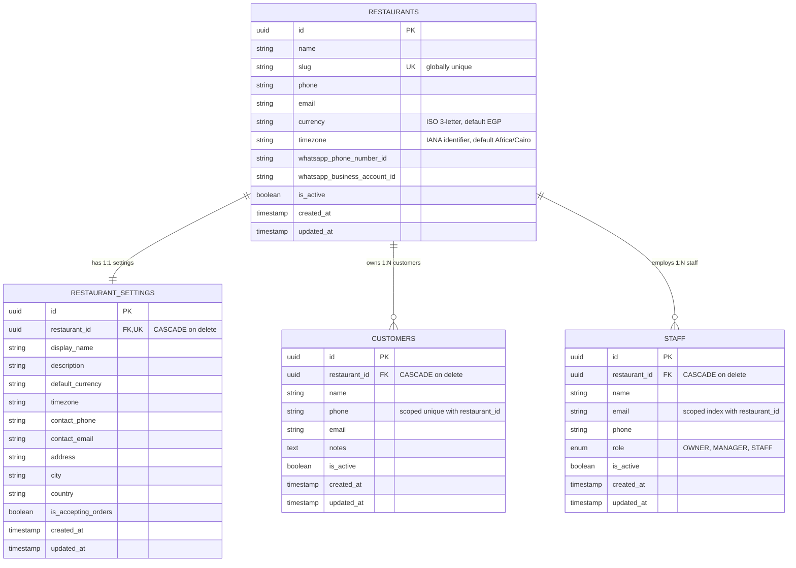

# Architecture Design Document

## 1. Overview

**Restaurant AI Agent** is a multi-tenant SaaS platform designed to automate restaurant ordering via conversational channels (such as WhatsApp) powered by autonomous AI agents.

> [!IMPORTANT]
> **Phase 2 Implementation Scope**: Phase 2 establishes the production multi-tenant database foundation (`Restaurant`, `RestaurantSettings`, `Customer`, `Staff`), Alembic migrations, tenant isolation guarantees, slug auto-generation, and full REST CRUD endpoints.
> Menu management, cart state, order processing, payments, kitchen displays, WhatsApp webhooks, and live LLM calls are strictly reserved for subsequent phases.

---

## 2. High-Level Architecture Diagram

```
┌────────────────────────────────────────────────────────┐
│                   Next.js Web Client                   │
│         (Subsystem Health & Tenant Foundation UI)       │
└───────────────────────────┬────────────────────────────┘
                            │ HTTP / REST
                            ▼
┌────────────────────────────────────────────────────────┐
│                     FastAPI App                        │
│                                                        │
│  ┌──────────────────┐          ┌────────────────────┐  │
│  │   /api/v1/health │          │ Structured Logger  │  │
│  └──────────────────┘          │ (Correlation ID)   │  │
│  ┌──────────────────────────────────────────────┐   │  │
│  │  /api/v1/restaurants                         │   │  │
│  │    ├── /{id}/settings                        │   │  │
│  │    ├── /{id}/customers                       │   │  │
│  │    └── /{id}/staff                           │   │  │
│  └──────────────────────┬───────────────────────┘   │  │
│                         │                              │
│  ┌──────────────────────┴┐     ┌────────────────────┐  │
│  │ Multi-Tenant Service  │     │ AI Provider Router │  │
│  │ & Domain Layer        │     │ (OpenAI/Groq/HF)   │  │
│  └──────────┬────────────┘     └─────────┬──────────┘  │
└─────────────┼────────────────────────────┼─────────────┘
              │                            │
       ┌──────┴──────┐              ┌──────┴──────────────┐
       │             │              │ Abstract Interface  │
       ▼             ▼              ▼                     ▼
  ┌──────────┐ ┌───────────┐ ┌────────────┐        ┌─────────────┐
  │PostgreSQL│ │   Redis   │ │   OpenAI   │        │    Groq     │
  │ Database │ │Cache/State│ │(Stub/Mock) │        │ (Stub/Mock) │
  └──────────┘ └───────────┘ └────────────┘        └─────────────┘
```

---

## 3. Multi-Tenant Domain Model (Phase 2)

### 3.1 Entity Relationship Diagram



### 3.2 Design Specifications

1. **UUID Primary Keys**: Every entity uses a cryptographically secure UUIDv4 (`UUIDPrimaryKeyMixin`).
2. **UTC Timestamps**: Microsecond-precision UTC timestamps (`created_at`, `updated_at`) managed automatically.
3. **Foreign Keys with Cascade**: All child tables (`restaurant_settings`, `customers`, `staff`) reference `restaurants.id` with `ondelete="CASCADE"`. Deleting a restaurant cleanly purges all its scoped records.
4. **Scoped Uniqueness**:
   - `customers`: `UniqueConstraint("restaurant_id", "phone", name="uq_customers_restaurant_phone")`. A customer phone number may exist in multiple distinct restaurants, but cannot be duplicated within a single restaurant tenant.
   - `staff`: Indexed on `(restaurant_id, email)`. Email collision within the same restaurant is rejected at the service layer with `VALIDATION-001`.
   - `restaurants`: `slug` is globally unique and indexed.

---

## 4. Multi-Tenant Isolation & Scoping Guarantees

Strict multi-tenant security is enforced at every layer:

1. **Query Scoping**: Every database lookup for tenant-owned data (`Customer`, `Staff`, `Settings`) filters explicitly by both resource ID and `restaurant_id`:
   ```python
   stmt = select(Customer).where(Customer.id == customer_id, Customer.restaurant_id == restaurant_id)
   ```
2. **Zero Information Leakage**:
   If Tenant B requests a customer or staff ID belonging to Tenant A, the system returns **HTTP 404 Not Found** (`CUSTOMER-001` or `STAFF-001`), exactly as if the resource never existed. It never returns 403 Forbidden for cross-tenant IDs, preventing attacker ID enumeration.
3. **Automatic Lifecycle Hook**:
   When a new `Restaurant` is created via `RestaurantService.create_restaurant`, a corresponding `RestaurantSettings` record is atomically created in the same database transaction.

---

## 5. Slug Generation & Collision Resolution

The `RestaurantService.generate_unique_slug` algorithm ensures URL-friendly and unique slugs:

1. **Sanitization**: Strips whitespace, converts to lowercase, replaces punctuation and non-alphanumeric characters with hyphens (e.g., `"Mama's & Papa's BBQ!"` → `"mamas-papas-bbq"`).
2. **Fallback**: If non-ASCII input produces an empty string, falls back to `"restaurant"`.
3. **Collision Resolution**: Checks database for slug availability. If taken, appends incrementing numeric suffixes (`-1`, `-2`, `-3`, ...) until an available slug is found.

---

## 6. Error Code Reference

Uniform API error envelopes follow the Phase 1 standard:

| Error Code | HTTP Status | Description |
| :--- | :--- | :--- |
| `REST-001` | 404 | Restaurant not found for the specified UUID. |
| `CUSTOMER-001` | 404 | Customer not found within this restaurant tenant. |
| `STAFF-001` | 404 | Staff member not found within this restaurant tenant. |
| `TENANT-001` | 403 | Tenant mismatch or unauthorized tenant operation. |
| `VALIDATION-001` | 409 | Duplicate resource (e.g., duplicate phone or email within tenant). |
| `SYS-001` | 500 | Unhandled internal server error. |
