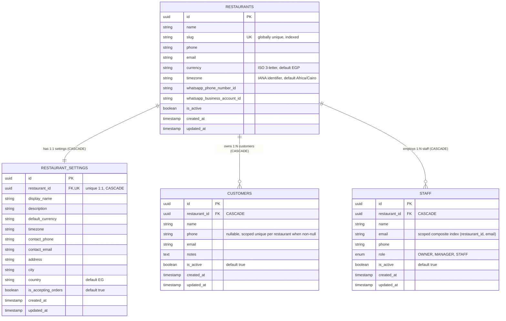

# Phase 2: Database & Restaurant Foundation Report

## 1. Executive Summary

Phase 2 establishes the multi-tenant database schema, domain models, business logic services, and REST API foundation for **Restaurant AI Agent**. All downstream capabilities (menus, carts, ordering, payments, and conversational AI) rely upon the secure tenant boundary and relational integrity established in this phase.

### Scope Boundaries Observed
- **Included**: Multi-tenant database models (`Restaurant`, `RestaurantSettings`, `Customer`, `Staff`), Alembic migration DDL, transactional default settings creation, slug generation and collision resolution, scoped unique constraints, strict tenant isolation, development database seed script, Next.js foundation view, and comprehensive automated test suite (65 tests).
- **Excluded**: WhatsApp integration, conversational AI agent execution, menu catalog, cart state, order processing, payments, kitchen displays, authentication/passwords, and subscriptions.

---

## 2. Multi-Tenant Entity Model

### 2.1 Entity Relationship Diagram



---

## 3. API Endpoints Reference

### 3.1 Restaurants (`/api/v1/restaurants`)

#### `POST /api/v1/restaurants`
Onboard a new restaurant. Generates a unique slug and atomically creates default operational settings.

**Request Payload:**
```json
{
  "name": "Artisan Bistro",
  "currency": "EGP",
  "timezone": "Africa/Cairo",
  "phone": "+201012345678",
  "email": "contact@artisanbistro.com"
}
```

**Response Payload (`201 Created`):**
```json
{
  "id": "550e8400-e29b-41d4-a716-446655440000",
  "name": "Artisan Bistro",
  "slug": "artisan-bistro",
  "currency": "EGP",
  "timezone": "Africa/Cairo",
  "phone": "+201012345678",
  "email": "contact@artisanbistro.com",
  "whatsapp_phone_number_id": null,
  "whatsapp_business_account_id": null,
  "is_active": true,
  "created_at": "2026-09-23T20:00:00Z",
  "updated_at": "2026-09-23T20:00:00Z"
}
```

#### `GET /api/v1/restaurants`
List all registered restaurants with pagination (`skip`, `limit`).

#### `GET /api/v1/restaurants/{id}`
Retrieve a restaurant by UUID. Returns `404` (`REST-001`) if not found.

#### `PATCH /api/v1/restaurants/{id}`
Update mutable fields (`name`, `phone`, `email`, `currency`, `timezone`, `is_active`).

---

### 3.2 Restaurant Settings (`/api/v1/restaurants/{id}/settings`)

#### `GET /api/v1/restaurants/{id}/settings`
Retrieve operational parameters for a restaurant.

**Response Payload (`200 OK`):**
```json
{
  "id": "770e8400-e29b-41d4-a716-446655440001",
  "restaurant_id": "550e8400-e29b-41d4-a716-446655440000",
  "display_name": "Artisan Bistro",
  "description": null,
  "default_currency": "EGP",
  "timezone": "Africa/Cairo",
  "contact_phone": "+201012345678",
  "contact_email": "contact@artisanbistro.com",
  "address": null,
  "city": null,
  "country": "EG",
  "is_accepting_orders": true,
  "created_at": "2026-09-23T20:00:00Z",
  "updated_at": "2026-09-23T20:00:00Z"
}
```

#### `PATCH /api/v1/restaurants/{id}/settings`
Update operational settings (e.g. pause ordering, change address).

---

### 3.3 Customers (`/api/v1/restaurants/{id}/customers`)

#### `POST /api/v1/restaurants/{id}/customers`
Register a customer scoped to this restaurant.

**Request Payload:**
```json
{
  "name": "Ahmed Ali",
  "phone": "+201011112222",
  "email": "ahmed@example.com",
  "notes": "No nuts"
}
```

**Response Payload (`201 Created`):**
```json
{
  "id": "880e8400-e29b-41d4-a716-446655440002",
  "restaurant_id": "550e8400-e29b-41d4-a716-446655440000",
  "name": "Ahmed Ali",
  "phone": "+201011112222",
  "email": "ahmed@example.com",
  "notes": "No nuts",
  "is_active": true,
  "created_at": "2026-09-23T20:00:00Z",
  "updated_at": "2026-09-23T20:00:00Z"
}
```

*Note: Customer phone rules:*
- `Customer.phone` is **nullable**.
- **Multiple NULL phones are allowed** within the same restaurant (e.g. walk-in patrons or web sessions without an upfront phone number).
- **Non-null phone numbers are unique per restaurant**: Submitting a duplicate non-null phone within the same restaurant returns `409 Conflict` (`VALIDATION-001`).
- The same non-null phone number is allowed across different restaurants.
- Enforced at the database level via a PostgreSQL partial unique index:
  ```sql
  CREATE UNIQUE INDEX uq_customers_restaurant_phone
  ON customers (restaurant_id, phone)
  WHERE phone IS NOT NULL;
  ```

#### `GET /api/v1/restaurants/{id}/customers`
List customers for this tenant.

#### `GET /api/v1/restaurants/{id}/customers/{customer_id}`
Retrieve a specific customer. If the customer exists but belongs to another restaurant, returns `404 Not Found` (`CUSTOMER-001`) with zero data leakage.

#### `PATCH /api/v1/restaurants/{id}/customers/{customer_id}`
Update customer attributes under tenant isolation.

---

### 3.4 Staff (`/api/v1/restaurants/{id}/staff`)

#### `POST /api/v1/restaurants/{id}/staff`
Register a staff member (`role` must be one of `OWNER`, `MANAGER`, `STAFF`).

**Request Payload:**
```json
{
  "name": "Hassan Ibrahim",
  "email": "hassan@artisanbistro.com",
  "role": "MANAGER",
  "phone": "+201099887766"
}
```

**Response Payload (`201 Created`):**
```json
{
  "id": "990e8400-e29b-41d4-a716-446655440003",
  "restaurant_id": "550e8400-e29b-41d4-a716-446655440000",
  "name": "Hassan Ibrahim",
  "email": "hassan@artisanbistro.com",
  "phone": "+201099887766",
  "role": "MANAGER",
  "is_active": true,
  "created_at": "2026-09-23T20:00:00Z",
  "updated_at": "2026-09-23T20:00:00Z"
}
```

#### `GET /api/v1/restaurants/{id}/staff`
List staff members for this tenant.

#### `GET /api/v1/restaurants/{id}/staff/{staff_id}`
Retrieve a staff member. Returns `404 Not Found` (`STAFF-001`) if belonging to another tenant.

#### `PATCH /api/v1/restaurants/{id}/staff/{staff_id}`
Update staff role or contact details under tenant isolation.

---

## 4. Verification Checklist & Test Results

| Verification Area | Requirement | Result |
| :--- | :--- | :--- |
| **Data Models** | UUID PKs, UTC timestamps, `ON DELETE CASCADE`, composite indexes | Passed (`tests/test_database_models.py`) |
| **Restaurants** | Normalization, slug collision resolution (`-1`, `-2`), CRUD | Passed (`tests/test_restaurants.py`) |
| **Default Settings** | Created atomically inside same transaction upon restaurant creation | Passed (`test_create_restaurant_with_default_settings`) |
| **Settings** | Get & Update operational parameters, currency/timezone validation | Passed (`tests/test_restaurant_settings.py`) |
| **Customers** | Scoped phone uniqueness (`uq_customers_restaurant_phone`), CRUD | Passed (`tests/test_customers.py`) |
| **Staff** | Role enum validation (`OWNER`, `MANAGER`, `STAFF`), scoped uniqueness | Passed (`tests/test_staff.py`) |
| **Multi-Tenancy** | Cross-tenant access returns 404 with zero info leakage | Passed (`tests/test_multi_tenancy.py`) |
| **Alembic Migration** | Generates valid PostgreSQL DDL for upgrade and downgrade | Passed (`alembic upgrade head --sql`) |
| **Development Seed** | Explicit execution only, production-guarded, idempotent | Passed (`backend/app/db/seed.py`) |
| **Code Formatting** | Clean Ruff lint and Black/Ruff formatting | Passed (`ruff check .`, `ruff format --check .`) |
| **Frontend UI** | Preserves Phase 1 health checks, handles offline DB, displays tenant info | Passed (`npm run build`) |
